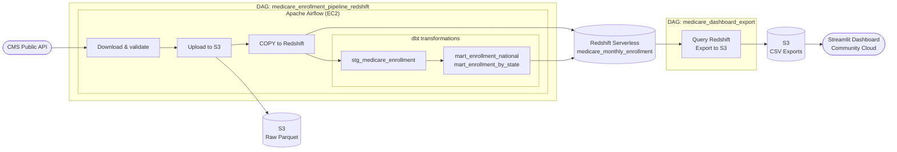
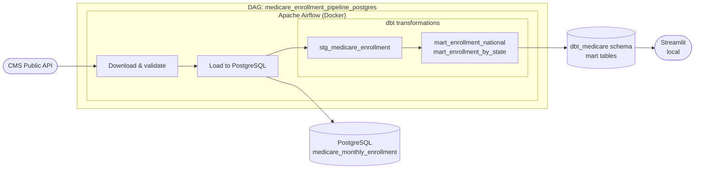
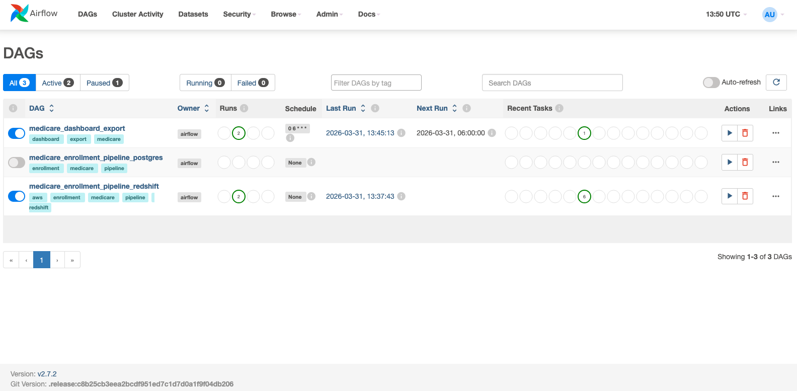
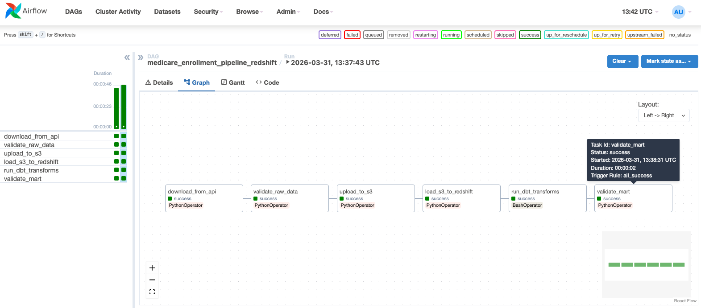
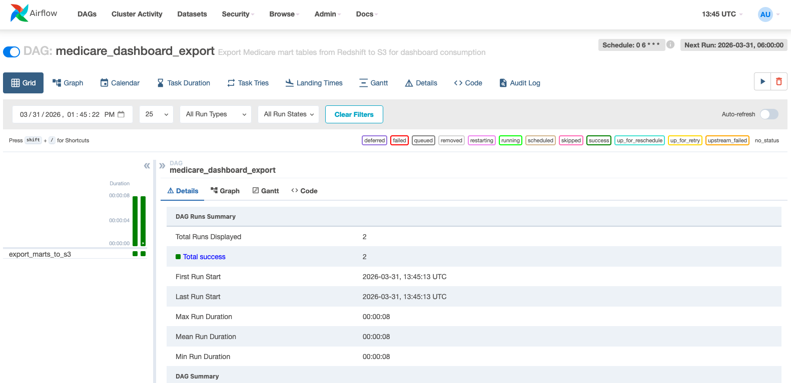
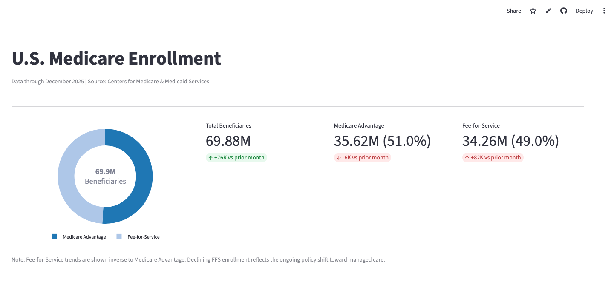
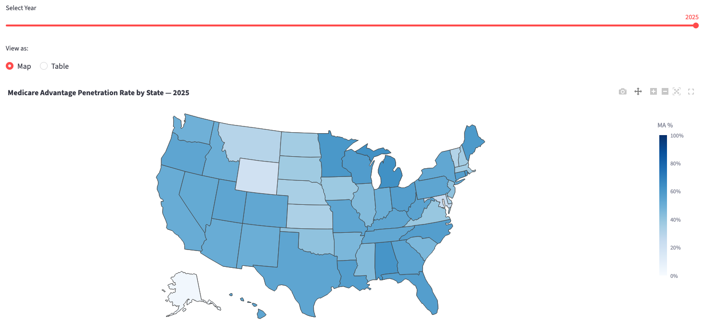
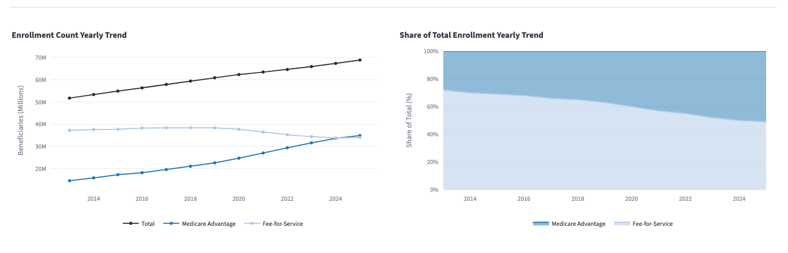

# Medicare Enrollment Analytics Pipeline


An end-to-end batch data pipeline that ingests, transforms, and visualizes U.S. Medicare enrollment data published monthly by the Centers for Medicare & Medicaid Services (CMS). The pipeline processes enrollment figures for over 65 million beneficiaries across all U.S. states and counties, loading them into a cloud data warehouse and surfacing trends through an interactive dashboard.

Live dashboard: [Medicare Enrollment Dashboard](https://medicare-analytics.streamlit.app/)

Live documentation: [dbt docs](https://rdanielsstat.github.io/medicare-analytics/)

## Overview


Medicare enrollment data is published monthly by CMS and covers all 50 states at the national, state, and county level, broken down by plan type, age, sex, and demographic group. Tracking this data over time reveals trends in Medicare Advantage adoption, demographic shifts, and geographic variation in coverage — but the raw CMS files require significant cleaning and transformation before they are analytically useful.

This project builds a production-style pipeline that automates that process end-to-end: ingesting raw parquet files from the CMS API, staging them in Amazon S3, loading into Amazon Redshift Serverless, transforming with dbt into analytics-ready mart tables, and exporting results to S3 for dashboard consumption. The entire cloud infrastructure is defined as code using OpenTofu (open-source Terraform).

## Architecture

### Cloud Pipeline (AWS)


### Local Development Pipeline


## Dataset

**Source:** Centers for Medicare & Medicaid Services (CMS) — Monthly Enrollment by Contract/Plan/State/County
**Coverage:** January 2013 through present (monthly updates)
**Volume:** ~557,000 rows per monthly snapshot across all geographic levels
**Geographic levels:** National, State, County
**Key metrics per record:**
- Total beneficiaries
- Original Medicare vs. Medicare Advantage enrollment
- Aged vs. disabled beneficiaries
- Enrollment by sex
- FIPS codes and state/county identifiers

The data dictionary is included at `docs/Medicare Monthly Enrollment Data Dictionary.pdf`.

## Tech Stack

| Layer              | Local                         | Cloud                      |
|--------------------|-------------------------------|----------------------------|
| Orchestration      | Apache Airflow 2.9.0 (Docker) | Apache Airflow 2.7.2 (EC2) |
| Data Lake          | Docker volume                 | Amazon S3                  |
| Data Warehouse     | PostgreSQL 17 (Docker)        | Amazon Redshift Serverless |
| Transformations    | dbt-postgres                  | dbt-redshift               |
| Infrastructure     | Docker Compose                | OpenTofu (IaC)             |
| Dashboard          | Streamlit (local)             | Streamlit Community Cloud  |
| Package Management | uv                            | uv                         |
| CI                 | GitHub Actions                | GitHub Actions             |

## Project Structure

```
medicare-analytics/
├── .github/
│   └── workflows/
│       └── ci.yml                                          # GitHub Actions CI
├── dags/
│   ├── pipelines/
│   │   ├── medicare_enrollment_pipeline_postgres.py        # Local pipeline DAG
│   │   └── medicare_enrollment_pipeline_redshift.py        # AWS pipeline DAG
│   └── exports/
│       └── enrollment_dashboard_export.py                  # Export marts to S3
├── dashboards/
│   └── app.py                                              # Streamlit dashboard
├── dbt_profiles/
│   └── profiles.yml                                        # dbt connection profiles
├── docs/
│   ├── catalog.json                                        # dbt docs catalog
│   ├── index.html                                          # dbt docs site
│   ├── manifest.json                                       # dbt docs manifest
│   └── Medicare Monthly Enrollment Data Dictionary.pdf
├── infra/                                                  # OpenTofu IaC
│   ├── ec2.tf
│   ├── iam.tf
│   ├── main.tf
│   ├── outputs.tf
│   ├── redshift.tf
│   ├── s3.tf
│   ├── variables.tf
│   ├── vpc.tf
│   └── terraform.tfvars.example
├── medicare_dbt/
│   ├── models/
│   │   ├── staging/
│   │   │   ├── sources.yml
│   │   │   ├── schema.yml
│   │   │   └── stg_medicare_enrollment.sql
│   │   └── marts/
│   │       ├── schema.yml
│   │       ├── mart_enrollment_national.sql
│   │       └── mart_enrollment_by_state.sql
│   └── dbt_project.yml
├── notebooks/
│   ├── 01_explore_enrollment_data.ipynb
│   ├── 02_query_postgres.ipynb
│   └── 03_app_testing.ipynb
├── src/
│   ├── db/
│   │   └── init/
│   │       └── 01_create_airflow_db.sql
│   ├── ingestion/
│   │   └── medicare_enrollment.py                          # CMS API client
│   └── loaders/
│       ├── postgres.py                                     # PostgreSQL loader
│       ├── redshift.py                                     # Redshift loader
│       └── s3.py                                           # S3 loader
├── .env.example
├── .env.aws.example
├── docker-compose.yml                                      # Local development
├── docker-compose.aws.yml                                  # EC2 deployment
├── Dockerfile.airflow
├── Makefile
└── pyproject.toml
```

## Data Pipeline

### Local Pipeline (PostgreSQL)

Five-step Airflow DAG (`medicare_enrollment_pipeline_postgres`):

1. `download_from_api` — fetches monthly enrollment data from the CMS API, saves as parquet to the local filesystem
2. `validate_raw_data` — checks row counts and required columns
3. `load_to_postgres` — loads parquet into the PostgreSQL staging table
4. `run_dbt_transforms` — runs dbt models against PostgreSQL (dev target)
5. `validate_mart` — confirms mart table row counts

### Cloud Pipeline (Redshift)

Six-step Airflow DAG (`medicare_enrollment_pipeline_redshift`):

1. `download_from_api` — fetches from the CMS API, saves parquet locally on EC2
2. `validate_raw_data` — validates raw data integrity
3. `upload_to_s3` — uploads parquet to S3, skips if the file already exists
4. `load_s3_to_redshift` — `CREATE TABLE IF NOT EXISTS` + `TRUNCATE` + `COPY FROM S3`
5. `run_dbt_transforms` — runs dbt with the Redshift prod target via IAM authentication
6. `validate_mart` — queries `dbt_medicare.mart_enrollment_national` via the Redshift Data API

### Dashboard Export Pipeline

Separate DAG (`medicare_dashboard_export`) triggered after the main pipeline completes each month:

- Queries both mart tables from Redshift via the Data API
- Writes `enrollment_national.csv` and `enrollment_by_state.csv` to S3
- Streamlit reads these CSVs directly — no direct Redshift connection required from the dashboard

## dbt Transformations

The dbt project (`medicare_dbt`) follows a staging and mart layer architecture:

### Staging Layer (`dbt_medicare` schema, materialized as views)

`stg_medicare_enrollment` — cleans and standardizes the raw enrollment table:
- Casts year to integer
- Renames all CMS column names to readable equivalents
- Passes through all geographic levels and months for downstream filtering

### Mart Layer (materialized as tables)

`mart_enrollment_national` — one row per month at the national level:
- Filters to `bene_geo_lvl = 'National'` and excludes annual summary rows
- Constructs a `report_date` column compatible with both PostgreSQL and Redshift using `` conditional logic
- Calculates Medicare Advantage and fee-for-service penetration rates as a percentage of total beneficiaries
- Ordered by `report_date`

`mart_enrollment_by_state` — one row per state per year using the CMS annual snapshot:
- Filters to `bene_geo_lvl = 'State'` and `month = 'Year'` (CMS annual totals)
- Excludes unknown state code `'UK'`
- Includes FIPS codes for choropleth map rendering
- Calculates Medicare Advantage and fee-for-service penetration rates as a percentage of total beneficiaries
- Ordered by year and state abbreviation

### Testing

16 data tests defined across staging and mart layers using `dbt-utils`:
- `not_null` on key columns in staging and both mart tables
- `accepted_values` on `bene_geo_lvl` in staging
- `unique` on `report_date` in `mart_enrollment_national`
- `unique_combination_of_columns` on `(year, month)` and `(year, state)` to enforce mart grain

Tests run automatically in CI against PostgreSQL. Run against Redshift after each monthly pipeline run:
```bash
cd medicare_dbt
dbt test --profiles-dir ../dbt_profiles --target prod
```

### dbt Documentation

Live documentation including lineage graph, model descriptions, and column definitions:  
[https://rdanielsstat.github.io/medicare-analytics/](https://rdanielsstat.github.io/medicare-analytics/)

To regenerate locally:
```bash
cd medicare_dbt
dbt docs generate --profiles-dir ../dbt_profiles --target local
dbt docs serve --profiles-dir ../dbt_profiles --target local
```

## Data Warehouse Design

**Table:** `public.medicare_monthly_enrollment`

**Optimization:** `DISTKEY (bene_state_abrvtn)` — `SORTKEY (year, month, bene_state_abrvtn)`

The distribution key on `bene_state_abrvtn` collocates rows by state across Redshift compute nodes, minimizing data movement for state-based joins and aggregations. The sort key on `(year, month, bene_state_abrvtn)` optimizes the most common query patterns — filtering by time period and slicing by state — by minimizing the number of 1MB blocks scanned per query.

In Redshift, `DISTKEY` and `SORTKEY` are the idiomatic equivalents of partitioning and clustering in other data warehouse platforms such as BigQuery. This implementation satisfies the same query optimization goals.

All numeric columns use `DOUBLE PRECISION` to match the `float64` types in the source parquet files, avoiding casting overhead during `COPY`.

## Infrastructure (OpenTofu / Terraform)

All AWS resources are defined as code in `infra/`:

| Resource            | Details                                                         |
|---------------------|-----------------------------------------------------------------|
| VPC                 | Dedicated VPC with 3 public subnets across 3 availability zones |
| EC2                 | `t3.large`, Amazon Linux 2023, Elastic IP                       |
| S3                  | Single bucket for raw parquet and CSV exports                   |
| Redshift Serverless | 32 RPU base capacity, `medicare_db` database                    |
| IAM — EC2 role      | S3 read/write, Redshift Data API access                         |
| IAM — Redshift role | S3 read/write for COPY and UNLOAD operations                    |
| Security Groups     | SSH restricted to specified CIDR, Airflow UI on port 8080       |

Provision infrastructure:
```bash
cd infra
cp terraform.tfvars.example terraform.tfvars
# Fill in terraform.tfvars with your values
tofu init
tofu plan
tofu apply
```

See the [Monthly Run Checklist](#monthly-run-checklist) for the recommended teardown sequence that preserves S3, VPC, and IAM resources between monthly runs.

## CI/CD

GitHub Actions runs on every push and pull request:

**Lint job:**
- Installs `flake8`
- Lints `dags/`, `src/`, and `dashboards/` with max line length 120

**dbt validation job:**
- Spins up a PostgreSQL service container
- Installs `dbt-postgres`, `dbt-redshift`, and `dbt-utils` via `dbt deps`
- Creates a `profiles.yml` pointing to the CI PostgreSQL instance
- Runs `dbt compile` to validate all model SQL
- Runs `dbt test` — 16 data tests across staging and mart layers

The CI configuration is at `.github/workflows/ci.yml`.

## Dashboard

The Streamlit dashboard is deployed at Streamlit Community Cloud and detects its environment automatically:

- **Local:** connects to PostgreSQL via SQLAlchemy, reads from the `dbt_medicare` schema
- **Cloud:** reads pre-exported CSV files from S3 via boto3

**Row 1 — Enrollment Summary**

A donut chart showing the current MA vs FFS split with total beneficiaries at center, alongside three KPI metric cards displaying total beneficiaries, Medicare Advantage enrollment, and Fee-for-Service enrollment — each with month-over-month deltas.

**Row 2 — State-Level View**

A US choropleth map shaded by Medicare Advantage penetration rate, with a year slider and a toggle to switch to a sortable state-level data table. Hover data includes MA rate, FFS rate, and total beneficiaries per state.

**Row 3 — Enrollment Trends**

Two side-by-side yearly trend charts: an enrollment count line chart showing total, MA, and FFS beneficiaries in millions; and a stacked area chart showing MA vs FFS share of total enrollment as a percentage over time.

## Local Setup

### Prerequisites

- Docker Desktop
- Python 3.12+
- `uv` package manager (`pip install uv`)
- AWS CLI (for cloud deployment only)
- OpenTofu (for infrastructure provisioning only)

### 1. Clone the repository
```bash
git clone https://github.com/rdanielsstat/medicare-analytics.git
cd medicare-analytics
```

### 2. Install dependencies
```bash
uv sync
```

### 3. Configure environment variables
```bash
cp .env.example .env
# Edit .env with your values
```

Required variables:
```
POSTGRES_USER=your_db_user
POSTGRES_PASSWORD=your_db_password
POSTGRES_DB=medicare_db
POSTGRES_PORT=5432
PGADMIN_DEFAULT_EMAIL=your_email@example.com
PGADMIN_DEFAULT_PASSWORD=your_pgadmin_password
AIRFLOW_UID=50000
AIRFLOW_FERNET_KEY=<generate with: python -c "from cryptography.fernet import Fernet; print(Fernet.generate_key().decode())">
```

### 4. Start services
```bash
make up
# or
docker compose up -d
```

This starts PostgreSQL, Airflow (scheduler + webserver), and pgAdmin.

### 5. Access Airflow

Navigate to `http://localhost:8080` — username `admin`, password `admin`.

### 6. Trigger the pipeline

In the Airflow UI, trigger `medicare_enrollment_pipeline_postgres` with parameter:
```json
{"release_month": "2025-12"}
```

### 7. Run the dashboard locally
```bash
cd dashboards
streamlit run app.py
```

### Makefile commands
```bash
make up        # Start all services
make down      # Stop all services
make logs      # Tail Airflow logs
make restart   # Restart services
```

## Cloud Deployment (AWS)

### Prerequisites

- AWS account with CLI configured
- OpenTofu installed
- EC2 key pair created in `us-east-1`

### 1. Provision infrastructure
```bash
cd infra
cp terraform.tfvars.example terraform.tfvars
# Fill in your values including key pair name and home IP CIDR
tofu init && tofu apply
```

Note the outputs — you will need the `ec2_public_ip` and `redshift_workgroup_endpoint`.

### 2. Configure EC2

If you have previously connected to an EC2 instance at this IP address, clear the old host key first:
```bash
ssh-keygen -R <ec2_public_ip>
```

SSH into the instance:
```bash
ssh -i ~/.ssh/your-key.pem ec2-user@<ec2_public_ip>
```

Clone the repository:
```bash
git clone https://github.com/rdanielsstat/medicare-analytics.git
cd medicare-analytics
git remote set-url --push origin no_push
```

Generate a Fernet key for `AIRFLOW_FERNET_KEY`:
```bash
python3 -c "from cryptography.fernet import Fernet; print(Fernet.generate_key().decode())"
```

Create your environment file from the template and fill in the values — you will need your Redshift endpoint, admin username, S3 bucket name, and IAM role ARN from the `tofu output` command:
```bash
cp .env.aws.example .env
vi .env
```

Set directory ownership to Airflow's container user (UID 50000) and start services:
```bash
mkdir -p logs data/raw/enrollment
sudo chown -R 50000:0 logs data/raw/enrollment medicare_dbt dbt_profiles
docker compose -f docker-compose.aws.yml up -d
```

Airflow authenticates to Redshift and S3 automatically via the EC2 IAM instance profile — no AWS credentials are needed in `.env`.

### 3. Set Airflow variables



In the Airflow UI (`http://<ec2-ip>:8080`), navigate to **Admin → Variables** and create the following:

| Key                  | Value                                                                | Notes               |
|----------------------|----------------------------------------------------------------------|---------------------|
| `S3_BUCKET`          | `medicare-analytics-raw-rdaniels`                                    | Your S3 bucket name |
| `REDSHIFT_IAM_ROLE`  | `arn:aws:iam::<account-id>:role/medicare-analytics-redshift-s3-role` | From `tofu output`  |
| `REDSHIFT_WORKGROUP` | `medicare-analytics-workgroup`                                       | Default, can omit   |
| `REDSHIFT_DATABASE`  | `medicare_db`                                                        | Default, can omit   |
| `AWS_REGION`         | `us-east-1`                                                          | Default, can omit   |

`S3_BUCKET` and `REDSHIFT_IAM_ROLE` are required — the others have defaults defined in the DAG code.

### 4. Grant Redshift permissions

Connect via **AWS Console → Redshift Serverless → Query editor v2** and run:
```sql
GRANT ALL ON DATABASE medicare_db TO "IAMR:medicare-analytics-ec2-airflow-role";
GRANT ALL ON SCHEMA public TO "IAMR:medicare-analytics-ec2-airflow-role";
CREATE SCHEMA IF NOT EXISTS dbt_medicare;
GRANT ALL ON SCHEMA dbt_medicare TO "IAMR:medicare-analytics-ec2-airflow-role";
ALTER SCHEMA dbt_medicare OWNER TO "IAMR:medicare-analytics-ec2-airflow-role";
```

This is required because dbt authenticates via the EC2 IAM instance role, not the admin username directly.

### 5. Trigger the pipeline

Trigger `medicare_enrollment_pipeline_redshift` with `{"release_month": "2025-12"}`, then trigger `medicare_dashboard_export`.




### 6. Tearing down between runs

When the pipeline run is complete, destroy the EC2 and Redshift resources to avoid ongoing charges. The S3 bucket, VPC, and IAM roles are inexpensive to leave running.

Shut down Docker cleanly before destroying infrastructure:
```bash
docker compose -f docker-compose.aws.yml down
exit
```

Then from your local machine in the `infra/` directory:
```bash
tofu destroy -target=aws_instance.airflow -target=aws_eip.airflow
```

Redshift can be removed via the AWS console under **Redshift Serverless → Namespaces**. All Tofu configuration remains intact and `tofu apply` will fully reprovision everything next run.

Remove raw staging files from S3 — the export CSVs used by the dashboard are preserved:
```bash
aws s3 rm s3:///enrollment/ --recursive
```

## Monthly Run Checklist

When new CMS data is published (typically mid-month), follow this sequence:

**1. Provision infrastructure**
```bash
cd infra
tofu apply
```

Note the `ec2_public_ip` from the outputs.

**2. Grant Redshift permissions**

On a fresh Redshift deployment, connect via **AWS Console → Redshift Serverless → Query editor v2** and run:
```sql
GRANT ALL ON DATABASE medicare_db TO "IAMR:medicare-analytics-ec2-airflow-role";
GRANT ALL ON SCHEMA public TO "IAMR:medicare-analytics-ec2-airflow-role";
CREATE SCHEMA IF NOT EXISTS dbt_medicare;
GRANT ALL ON SCHEMA dbt_medicare TO "IAMR:medicare-analytics-ec2-airflow-role";
ALTER SCHEMA dbt_medicare OWNER TO "IAMR:medicare-analytics-ec2-airflow-role";
```

This is required because dbt authenticates via the EC2 IAM instance role, not the admin username directly.

**3. Configure the EC2 instance**
```bash
ssh-keygen -R <ec2_public_ip>
ssh -i ~/.ssh/your-key.pem ec2-user@<ec2_public_ip>
git clone https://github.com/rdanielsstat/medicare-analytics.git
cd medicare-analytics
```

**4. Create environment file**

Copy `.env.aws.example` to `.env` and fill in all values.

Generate a Fernet key for `AIRFLOW_FERNET_KEY`:
```bash
python3 -c "from cryptography.fernet import Fernet; print(Fernet.generate_key().decode())"
```

**5. Set permissions and start services**
```bash
mkdir -p logs data/raw/enrollment
sudo chown -R 50000:0 logs data/raw/enrollment medicare_dbt dbt_profiles
docker compose -f docker-compose.aws.yml up -d
```

**6. Set Airflow Variables**

In the Airflow UI (`http://<ec2_public_ip>:8080`) under **Admin → Variables**, set `S3_BUCKET` and `REDSHIFT_IAM_ROLE` (see Cloud Deployment Step 3 for full table).

**7. Run the pipeline**

Trigger `medicare_enrollment_pipeline_redshift` with `{"release_month": "YYYY-MM"}`, then trigger `medicare_dashboard_export`.

**8. Run dbt tests against Redshift**
```bash
cd medicare_dbt
dbt test --profiles-dir ../dbt_profiles --target prod
```

**9. Verify the dashboard**

Confirm the dashboard at https://medicare-analytics.streamlit.app/ reflects the new data.





**10. Tear down**
```bash
docker compose -f docker-compose.aws.yml down
exit
tofu destroy -target=aws_instance.airflow -target=aws_eip.airflow
aws s3 rm s3:///enrollment/ --recursive
```

## Environment Variable Handling

Secrets are never committed to git. The pattern used throughout:

- `.env.example` and `.env.aws.example` — committed templates with placeholder values
- `.env` — gitignored, created manually on each machine
- `infra/terraform.tfvars` — gitignored, created manually
- Streamlit secrets — configured via Streamlit Community Cloud UI

### AWS Credential Contexts

This project uses three separate AWS credential contexts that must not be mixed:

| Context                   | Credential Source                    | User                                          |
|---------------------------|--------------------------------------|-----------------------------------------------|
| OpenTofu (infrastructure) | `~/.aws/credentials` default profile | IAM admin/infra user                          |
| Streamlit dashboard       | `.streamlit/secrets.toml`            | `streamlit-dashboard` IAM user (S3 read-only) |
| Airflow on EC2            | EC2 instance profile (automatic)     | IAM role via instance metadata                |

The `.env` file should not contain `AWS_ACCESS_KEY_ID` or `AWS_SECRET_ACCESS_KEY`. Tofu reads from `~/.aws/credentials` and the EC2 containers authenticate automatically via the attached IAM instance profile.

## Notebooks

Exploratory notebooks are in `notebooks/`:

- `01_explore_enrollment_data.ipynb` — initial data exploration of the CMS dataset
- `02_query_postgres.ipynb` — querying the local PostgreSQL warehouse
- `03_app_testing.ipynb` — prototyping dashboard queries

## Logging

Airflow task logs are written to `logs/` (gitignored, mounted as a Docker volume). Each task run produces a structured log file at:
```
logs/dag_id=<dag>/run_id=<run>/task_id=<task>/attempt=<n>.log
```

Application-level logging uses Python's standard `logging` module with `INFO` level throughout the DAG and loader modules.

## Acknowledgments

This project was built as part of the [Data Engineering Zoomcamp](https://github.com/DataTalksClub/data-engineering-zoomcamp) by [Alexey Grigorev](https://github.com/alexeygrigorev) and [DataTalks.Club](https://datatalks.club).